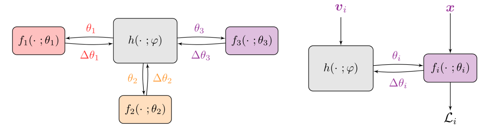

## Personalized Federated Learning using Hypernetworks
This is an official implementation of ***Personalized Federated Learning using Hypernetworks*** paper. [[Link]](https://arxiv.org/abs/2103.04628)



#### Installation
- Create a virtual environment with conda/virtualenv
- Clone the repo
- Run: ```cd <PATH_TO_THE_CLONED_REPO>```
- Run: ```pip install -e .``` to install necessary packages and path links.

---------

#### Reproduce Paper Results

---------
##### PfedHN Results on CIFAR10
- Run: ```cd experiments/pfedhn```
- Run: ```python trainer.py```

---------

##### PfedHN-PC Results on CIFAR10
- Run: ```cd experiments/pfedhn_pc```
- Run: ```python trainer.py```

#### Citation

If you find pFedHN to be useful in your own research, please consider citing the following paper:

```bib
@article{shamsian2021personalized,
  title={Personalized Federated Learning using Hypernetworks},
  author={Shamsian, Aviv and Navon, Aviv and Fetaya, Ethan and Chechik, Gal},
  journal={arXiv preprint arXiv:2103.04628},
  year={2021}
}
```
